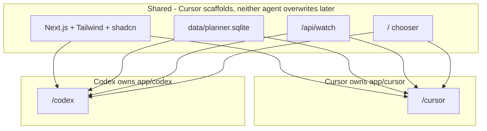
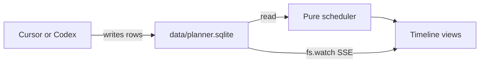
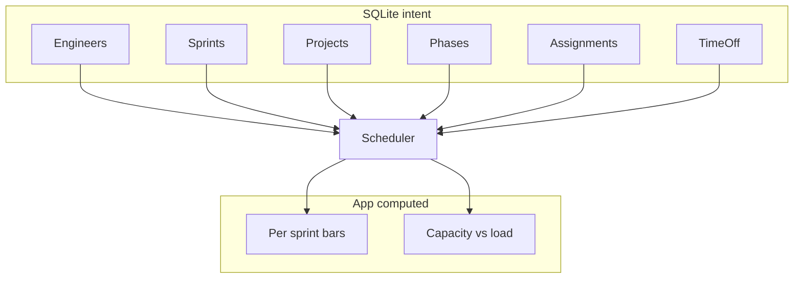
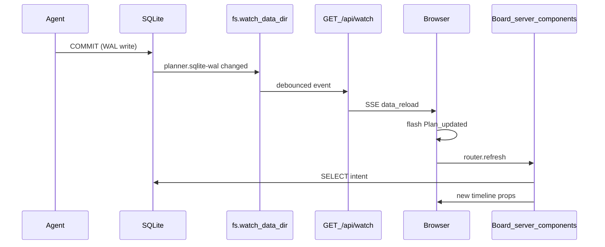
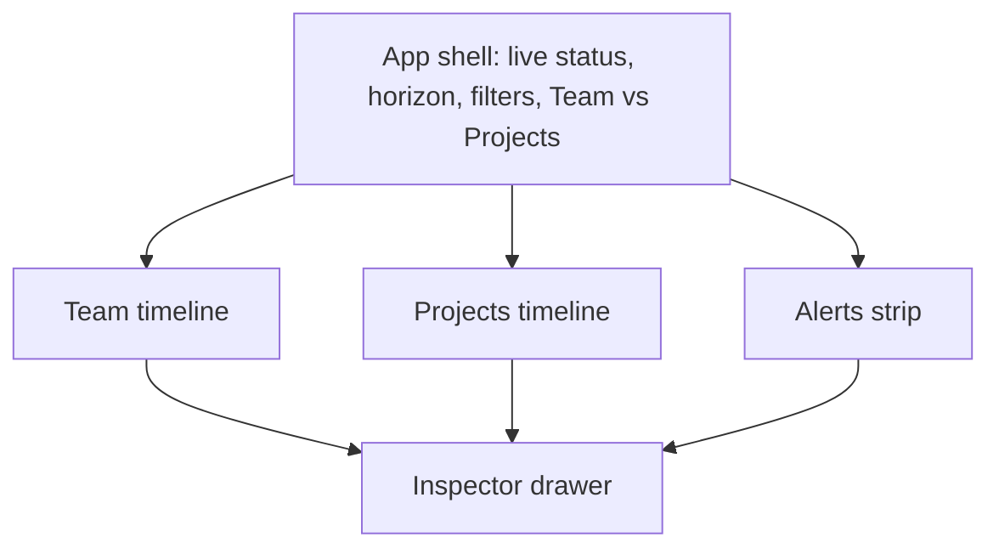

# Local sprint planner (view-first)

Greenfield Next.js app in this empty repo. SQLite is the plan; the app is a live computed view of it. Two agents implement the **same product** in **separate route trees** so you can compare them in one running app.

## Dual-agent layout (read this first)

One install, two implementations, one database.

**Cursor (this agent) does first:** install Next.js (App Router, TypeScript), Tailwind, shadcn/ui, `better-sqlite3`, Drizzle, Vitest, and other deps listed below. Create the SQLite schema, seed data, `AGENT.md`, shared DB helper, shared file-watch API, and a root page that links to both implementations. Then build the full v1 board **only** under [`app/cursor/`](app/cursor/).

**Codex does second (or in parallel once the scaffold exists):** build the full v1 board **only** under [`app/codex/`](app/codex/). Same UX spec, same SQLite file, same shadcn primitives. Own scheduler, own components, own tests.

URLs:

- [`/`](/) — chooser: “Cursor implementation” / “Codex implementation”
- [`/cursor`](/cursor) — this agent’s board
- [`/codex`](/codex) — the other agent’s board

### Shared vs owned (hard boundaries)

Shared (Cursor creates; Codex must not replace, rewrite, or “improve” these unless adding a missing shadcn primitive via the CLI):

- `package.json`, lockfile, `next.config.ts`, `tsconfig.json`, `tailwind.config.ts`, `postcss.config.mjs`, `components.json`
- `app/layout.tsx`, `app/globals.css`, `app/page.tsx` (the chooser only)
- `app/api/watch/route.ts`
- `components/ui/**` (shadcn). Codex may run `npx shadcn@latest add <component>` if something is missing. Do not restyle primitives.
- `lib/db.ts`, `lib/schema.ts` (Drizzle tables matching `data/schema.sql`)
- `data/schema.sql`, `data/seed.sql`, `data/planner.sqlite`
- `AGENT.md`

Owned by Cursor — Codex must not read-and-rewrite or delete:

- `app/cursor/**` including `_lib/` (scheduler) and `_components/`
- tests colocated there (e.g. `app/cursor/_lib/schedule.test.ts`)

Owned by Codex — Cursor must not touch after Codex starts:

- `app/codex/**` including `_lib/` and `_components/`
- tests colocated there

`_lib` and `_components` folders are private to App Router (not URL segments). Each board is a single `page.tsx` (plus a local `layout.tsx` if it needs its own chrome). Do **not** put a scheduler in top-level `lib/schedule.ts` — that would make the two implementations share logic and defeat the comparison.

### Dependencies Cursor installs (Codex should not re-scaffold)

- `next`, `react`, `react-dom`, TypeScript, ESLint
- Tailwind v4 (or whatever `create-next-app` currently defaults) + shadcn/ui (base-nova / default preset is fine)
- shadcn components likely needed: `button`, `badge`, `tabs` or toggle group, `dropdown-menu`, `popover`, `tooltip`, `scroll-area`, `separator`, `sheet` (inspector), `alert`
- `better-sqlite3` + types, `drizzle-orm`, `drizzle-kit`
- `vitest` (+ whatever is needed to run node tests)
- `lucide-react` (shadcn default)

### How to hand this to Codex

Paste **this entire plan**. Then add only this instruction:

> Scaffold already exists (or will in a moment). Implement the v1 sprint planner described in this plan at `app/codex/`. Route: `/codex`. Put scheduler and tests in `app/codex/_lib`, UI in `app/codex/_components`. Read SQLite via existing `lib/db.ts` and `data/planner.sqlite`. Subscribe to `/api/watch` for live reload. Use existing shadcn under `components/ui`. Do not modify `app/cursor`, `data/`, or replace the Next.js install. If `/` already links to `/codex`, leave the chooser alone; if the link is missing, add only that link on `app/page.tsx`.

## How it works

You (or Cursor/Codex) write **intent** into a SQLite file: who is on the team, which projects/phases exist, how big they are, and what fraction of each engineer goes to which phase. The app does **not** store Gantt bars. It runs a scheduler and draws the timeline.

That split is what makes “what if we add another project?” cheap later: you insert rows, the schedule recomputes, existing work stretches or moves if capacity is contended.

v1: read-only UI (filters, two lenses, tooltips, live refresh). Writes stay in the DB. Schema is designed so the same tables can be updated from the UI later.

## Domain model

**Time.** Sprints are first-class (default 2 weeks, 10 working days). Phase size is stored as **person-days** (1 person-week = 5 days) so holidays and partial sprints stay honest. The UI can still show weeks.

**Capacity.** Each engineer has FTE (1.0 = full sprint capacity). In a given sprint they can put fractions of that capacity on multiple active phases (e.g. 50% / 50%). Fractions on *currently eligible* phases should sum to ≤ 1.0; if they exceed 1.0 the scheduler scales them down and the UI flags overload.

**Projects and phases.** A project is an ordered list of phases (discovery, solution, backend, frontend, or any names you want). Default: phase N+1 starts when phase N is done (**finish-to-start**). A phase can opt into overlapping the previous one (`parallel_ok`) so frontend can trail backend.

**Assignments.** “Who works this phase, at what share of their time while it is active.” Not a cell per sprint. Example: backend is 30 person-days; Alice 100% and Bob 50% both assigned → ~20 person-days/sprint delivered → ~2 sprints, then frontend can start.

**Contention / push-out.** If Alice is already 100% on Project A’s active phase and you also assign her 50% to Project B, she is over-allocated. Scheduler normalizes by **project priority** (lower number wins): A keeps capacity, B gets leftover (possibly zero until A’s phase finishes). Changing fractions or priority is how you “give it to another engineer” or “slow A to start B.”

## SQLite contract (agent-first)

Canonical schema in [`data/schema.sql`](data/schema.sql), live DB at [`data/planner.sqlite`](data/planner.sqlite). Use **text slugs** as primary keys (`eng_alice`, `proj_checkout`, `phase_checkout_be`) so agents can insert without looking up integer IDs.

Tables (v1):

- `engineers` — `id`, `name`, `fte` (default 1.0), `sort_order`
- `sprints` — `id`, `name` (e.g. `2026-S18`), `start_date`, `end_date`, `working_days` (default 10)
- `projects` — `id`, `name`, `priority` (1 = first claim on contended capacity), `sort_order`
- `phases` — `id`, `project_id`, `name`, `kind` (optional: discovery/solution/backend/frontend/other), `sort_order`, `effort_days`, `parallel_ok` (0/1)
- `assignments` — `phase_id`, `engineer_id`, `fraction` (0–1), unique on (phase_id, engineer_id)
- `time_off` — `engineer_id`, `sprint_id`, `days_off` (optional; v1 can ship empty)

Enable WAL + `busy_timeout` so the app can read while an agent writes.

Add [`AGENT.md`](AGENT.md) as the editing manual: table meanings, units, a worked example (split a phase across two people; add a project and watch slip), and example SQL. Seed 2–3 projects and 3–4 engineers so the first load looks like a real team, not an empty grid.

Do **not** persist computed bars as source of truth. Optional later: a regenerated `schedule_bars` table purely so agents can `SELECT` the outcome.

## Scheduler (pure function)

Input: all intent tables. Output: for each (sprint, engineer, phase) the **days delivered** and remaining effort after that sprint; plus per-engineer load vs capacity.

Walk sprints in date order from “today’s sprint” (or a `planning_start` sprint):

1. Engineer capacity that sprint = `fte * working_days - time_off`.
2. A phase is **eligible** if remaining effort > 0 and either it is first, or the previous phase (by `sort_order`) is complete, or `parallel_ok` is set.
3. For each engineer, take assignments to eligible phases. If fractions sum to > 1, scale by project priority (keep higher-priority fractions, leftover to the rest).
4. Deliver `fraction * capacity` person-days to each phase, capped by remaining effort. Unused fraction is idle (shown as slack).
5. When remaining hits 0, the next sequential phase can become eligible in the **following** sprint (same sprint only if we later add intra-sprint chaining; v1 keeps it simple: completion is sprint-granular).

Unassigned phases with effort stay in an **Unscheduled** bucket so the view shows planning gaps.

Each implementation has its **own** testable scheduler (Cursor: [`app/cursor/_lib/schedule.ts`](app/cursor/_lib/schedule.ts); Codex: `app/codex/_lib/schedule.ts`) with fixtures: sequential phases, 50/50 split shortens a phase, adding a project with the same engineer stretches existing work, priority protects the incumbent. Shared code is the DB schema and reader only.

## App (Next.js, local only)

- Next.js App Router + TypeScript + Tailwind + shadcn/ui
- `better-sqlite3` + Drizzle (server-only). Native module; query only in server components / route handlers
- No auth. DB path from `PLANNER_DB` or `./data/planner.sqlite`
- Root [`app/page.tsx`](app/page.tsx) is a chooser, not the board. Each implementation is a single planning board (Team / Projects lenses on one page). v1 has no settings, login, or CRUD forms.

### Live reload (shared `/api/watch`)

The app never polls SQLite. An agent commit should show up on the board within a fraction of a second, without losing filter/highlight/inspector client state.

**Why watch the directory, not only `planner.sqlite`.** The DB runs in WAL mode so the agent and the Next server can share it. Most commits land in `planner.sqlite-wal`; the main file’s mtime often does not change until a checkpoint. Watch `data/` (Node runtime, not Edge). Ignore `*-shm`. Treat a change to `planner.sqlite` or `planner.sqlite-wal` as “plan may have changed.”

**Debounce (~200ms).** A single SQL script fires many write events. Collapse them into one SSE message so the UI does not refresh five times per agent edit.

**SSE route** [`app/api/watch/route.ts`](app/api/watch/route.ts) (one shared endpoint, both boards subscribe):

- `runtime = "nodejs"`, `dynamic = "force-dynamic"`
- `ReadableStream` with `Content-Type: text/event-stream`, no cache
- Module-level `fs.watch` with a set of connected controllers (do not start a new watcher per request if we can avoid it)
- On debounced file change: write `data: reload\n\n`
- Heartbeat every ~20s (`: ping\n\n`) so the connection is not killed
- On client abort: drop that subscriber

**Browser (each board’s client shell):** `new EventSource("/api/watch")`. On message: set a short-lived **Plan updated** flash, then `router.refresh()`. Close the EventSource on unmount. Manual refresh button calls `router.refresh()` if SSE is down. Live pill goes amber on `EventSource.onerror`.

**What `router.refresh()` does.** It re-runs the server components for the current route (`/cursor` or `/codex`) and passes new props into the client shell. Horizon, lens, filters, highlight, and inspector selection live in client state so they survive. Do **not** `window.location.reload()`.

**Do not cache the plan.** Board pages must opt out of Next’s fetch/RSC cache (`connection()` or `unstable_noStore()` / `dynamic = "force-dynamic"`). A cached server render would ignore agent writes even if SSE fires.

**SQLite connection.** A long-lived `better-sqlite3` handle in WAL mode sees other connections’ commits on the next `SELECT`. That is enough for normal `INSERT`/`UPDATE`. If an agent *replaces* the file (copy a new `.sqlite` over the old one), the handle can break — on SQLITE_IOERR / malformed DB, close and reopen. `busy_timeout` (~2000ms) covers the writer still being in a transaction when refresh runs.

**Not part of this loop:** the scheduler is a pure function of the SELECT result. Refresh → read intent → recompute bars. Nothing is persisted from the previous render.

## UX: screens and controls

The product is an EM’s **situation picture**, not a Jira clone. You glance at capacity, click something that looks wrong, and (in v1) copy a slug into Cursor/Codex to change the plan. Editing widgets are designed now so v2 can attach write-back to the same surfaces; they stay read-only in v1.

### App shell (always visible)

Top bar, left to right:

- Title + **live pill**: watching `planner.sqlite`, last refresh time. Turns amber if the file is missing or schema is stale. Manual refresh as fallback.
- **Horizon:** 6 / 8 / 12 sprints / All. Columns are sprints; this only crops the window.
- **Lens:** segmented `Team` | `Projects`. Same sprint columns, different rows. Selection and highlight survive the switch.
- **Filters:** project multi-select, engineer multi-select. Filters hide rows (and, on Team, hide another project’s segments inside a cell).
- **Highlight:** one project. Everything else dims so you can see one initiative across people or phases.
- **Copy snapshot** (optional v1 stretch): copy a short text summary of the visible window for standup.

No global search. Team-scale data does not need it.

### Alerts strip

A one-line band under the shell. Not a separate screen. Counts and the worst item; click opens a short list and selects the relevant bar.

v1 alert types:

- Engineer over-allocated in a sprint (requested fractions > 1.0)
- Idle engineer with unscheduled work that they are not assigned to (room exists, work is sitting)
- Phase with effort and **no assignments** (unscheduled)
- Phase assigned but **starts late** because a predecessor or higher-priority project is using the people

This is how “what happens if we add a project?” shows up: new alerts + existing bars that grew.

### Screen 1 — Team timeline (default)

**Question it answers:** Who is busy, who has slack, and can I absorb another project without slipping the current ones?

Layout:

- Frozen left column: engineer name, FTE.
- Frozen header: sprint id, date range, **current sprint** pill. Vertical line on the current column.
- Grid: one cell per engineer × sprint. The cell is a **horizontal split of that sprint’s capacity**. 50/50 is two half-width blocks; 100% is one full block; leftover capacity is a pale slack remainder.
- Time off: a distinct hatch or “PTO 2d” chip that shrinks the usable width before work is drawn.
- Overload: the cell does not grow past 100%; extra demand is a red tick / badge on the cell (“120% requested”).
- Color = project (stable across both lenses). Label inside the block: phase name, truncated. Initials if the block is tight.

**v1 controls:**

- Hover block: tooltip with project, phase, days this sprint, fraction, remaining effort.
- Click block or slack remainder: opens the inspector (slack shows “idle — N days”).
- Click engineer name: sets the engineer filter to that person (toggle off by clicking again).
- Horizontal scroll through sprints; keyboard left/right when the grid is focused.
- No drag, no resize, no in-cell editors.

**Why horizontal splits, not a classic Gantt bar across columns:** fractional capacity is the unit you chose. A sprint is a bucket. The important number is “what share of Alice is Checkout vs Payments this sprint,” not a freeform start date.

### Screen 2 — Projects timeline

**Question it answers:** When does this ship, which phase is on the critical path, and who is on each phase?

Layout:

- Rows grouped by project. Group header: name, **priority number**, total remaining person-days, **computed end sprint** (the date you actually care about).
- Child rows: one per phase, in `sort_order`. Phase bar **spans** the sprints the scheduler filled (classic Gantt). Label: assignees and fractions (`Alice 100% · Bob 50%`).
- `parallel_ok` phases can overlap the previous bar; sequential phases start the sprint after the predecessor finishes.
- Expand/collapse per project (all expanded by default).
- Bottom group **Unscheduled**: phases with effort and zero assignments. Empty bar, warning, still shows size so they are not invisible.

**v1 controls:**

- Same hover / click → inspector as Team.
- Click a project header: sets Highlight to that project (and stays highlighted on Team).
- Collapse control on the group chevron only.
- No drag-to-reschedule. Moving a bar would be lying; start/end are computed.

### Inspector (drawer, not a route)

Opens on the right (~360px) when anything is selected. This is the main “interactivity with the source data” in v1: you inspect intent vs computed outcome, then copy ids for the agent.

**Always shown:**

- Project name, phase name, kind
- **Slugs** (`proj_checkout`, `phase_checkout_be`) with one-click copy — the bridge to Cursor/Codex
- Effort (person-days / person-weeks), remaining after the current sprint
- Assignments: each engineer + fraction as a read-only bar (sums, flags if > 1 across that engineer’s eligible work)
- Computed window: start sprint, end sprint, duration
- **Why this start:** predecessor phase + its end, or “queued behind higher-priority X on Alice,” or “unassigned”

**v1 is display-only.** The assignment list *looks* like chips so v2 can add “+ engineer” and fraction sliders without a new layout.

Clicking an alert row selects the same inspector target.

### What we are not building in v1

- No forms to create projects, phases, people, or sprints
- No drag-and-drop, no effort spinners, no priority reorder
- No what-if sandbox / scenario compare
- No people admin or time-off calendar — those stay in SQLite
- No second window for a “spreadsheet of the DB”; the inspector plus `AGENT.md` cover trust in the numbers. A Plan table tab can wait until the timeline is wrong enough to need it.

### Hero loop (v1)

1. Open Team. Scan slack (pale remainders) and overload badges.
2. Highlight “Checkout.” Confirm it is sequential across Alice then Bob, or split on backend.
3. In Cursor, insert a new project + assignments in SQLite.
4. Shell flashes **Plan updated**. Checkout’s end sprint moves; an alert appears (“Checkout FE slips to S22; contended with Payments on Alice”).
5. Click the slipped phase. Inspector explains the queue. Copy `eng_dana` / `phase_payments_disc` and tell the agent to move the new work onto Dana.

That is the whole v1 product: **see the plan, see the impact, hand a precise edit to the agent.**

### v2 controls (same screens, write-back)

Do not build now; keep the layout ready:

- Inspector: fraction sliders, add/remove assignment chips, effort stepper, `parallel_ok` toggle
- Projects header: drag priority to reorder contention
- Team slack cell: “assign this idle slice to…” picker
- Shell: **What-if** toggle that copies the DB (or a `scenarios` row) so you can edit without touching the live plan
- Optional **Add project** drawer: name, phase template (discovery / solution / backend / frontend), sizes, first assignees — writes the same tables the agent would

## Later (do not build now; schema should not block)

- Write-back on the inspector and priority reorder, as above
- What-if copy: `scenarios` table or a second sqlite file
- Intra-sprint phase chaining, skills/role constraints, non-dev work as a phase kind
- Plan-table lens if the timeline is not enough to audit intent

## Implementation order

**Cursor**

1. Scaffold Next.js, shadcn, Drizzle, `data/schema.sql`, seed DB, `AGENT.md`, `lib/db.ts`, `lib/schema.ts`, `/api/watch`, chooser at `/` with links to `/cursor` and `/codex`
2. Scheduler + unit tests in `app/cursor/_lib`
3. Board at `/cursor`: app shell + Team timeline + alerts strip
4. Projects lens + inspector drawer (copy slugs)
5. Wire live reload + “Plan updated” flash
6. Seed that demonstrates split-phase, slack, and push-out so both lenses and alerts have something real to show

**Codex** (after scaffold exists; same product spec)

1. Do not re-create Next.js. Confirm `data/planner.sqlite` and `components/ui` exist.
2. Scheduler + unit tests in `app/codex/_lib`
3. Board at `/codex` with the same UX (shell, Team, Projects, alerts, inspector)
4. Subscribe to existing `/api/watch`
5. Leave `app/cursor` and `data/` untouched

## Brief for Codex (same plan, extra constraints)

You are implementing a **second** v1 of the sprint planner inside an existing repo, not starting a new project.

- **Route:** `/codex` ← `app/codex/page.tsx`
- **Put code in:** `app/codex/_components/**`, `app/codex/_lib/**` (scheduler + tests here)
- **Read data from:** `lib/db.ts` → `data/planner.sqlite` (schema in `data/schema.sql` / `lib/schema.ts`)
- **Live updates:** `EventSource('/api/watch')` already implemented at the repo root
- **UI kit:** `@/components/ui/*` (shadcn). Add a primitive with the shadcn CLI if missing; do not fork a parallel design system
- **Product:** everything under “UX: screens and controls” and “Domain model” / “Scheduler” in this plan
- **Do not:** modify `app/cursor/**`, replace `package.json` scripts wholesale, change the SQLite schema, or persist computed Gantt bars as source of truth
- **Chooser:** `/` should link to your board; only edit `app/page.tsx` if that link is missing

When finished, `/cursor` and `/codex` should both be usable against the same team data so the two UIs can be compared.
